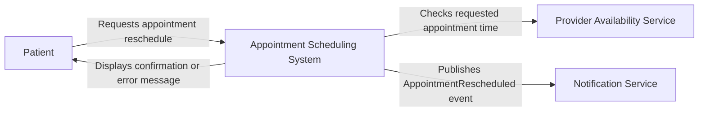

# patientschdeule
# Appointment Scheduling System

## Project Overview

This repository contains the requirements and design documents for an appointment scheduling system feature that allows patients to reschedule appointments.

The feature applies a late-change flag when a patient requests a reschedule less than 24 hours before the original appointment time.

## User Story

As a patient,  
I want to reschedule my appointment,  
so that I can choose a date and time that better fits my schedule.

## Acceptance Criteria

```gherkin
Scenario: Patient reschedules an appointment within 24 hours

Given a patient has a scheduled appointment for "2026-10-15T10:00:00Z"
When the patient requests to reschedule the appointment to "2026-10-16T14:00:00Z" less than 24 hours before the original appointment time
Then the system should apply a late-change flag
And emit an "AppointmentRescheduled" event to the Notification Service
And display a confirmation message with updated appointment details to the patient
```

## Context Diagram



## Repository Documents

- [User Story](docs/user-stories/US-001-reschedule-appointment.md)
- [Gherkin Acceptance Criteria](docs/acceptance-criteria/appointment-rescheduling.feature)
- [Context Diagram](docs/context-diagram.md)
- [API Documentation](docs/api/reschedule-appointment.md)
- [Appointment Rescheduled Event](events/AppointmentRescheduled.json)
- [Test Cases](tests/test-cases.md)
