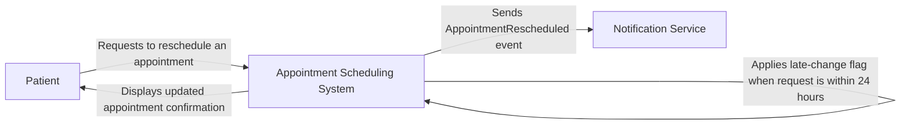

# Appointment Rescheduling Context Diagram

## Context Diagram

## Diagram Explanation

- The **Patient** requests to reschedule an existing appointment.
- The **Appointment Scheduling System** processes the request and determines whether it was made less than 24 hours before the original appointment.
- When the request is within 24 hours, the system applies a late-change flag.
- After successfully rescheduling the appointment, the system sends an `AppointmentRescheduled` event to the **Notification Service**.
- The system displays a confirmation message containing the updated appointment details to the **Patient**.
